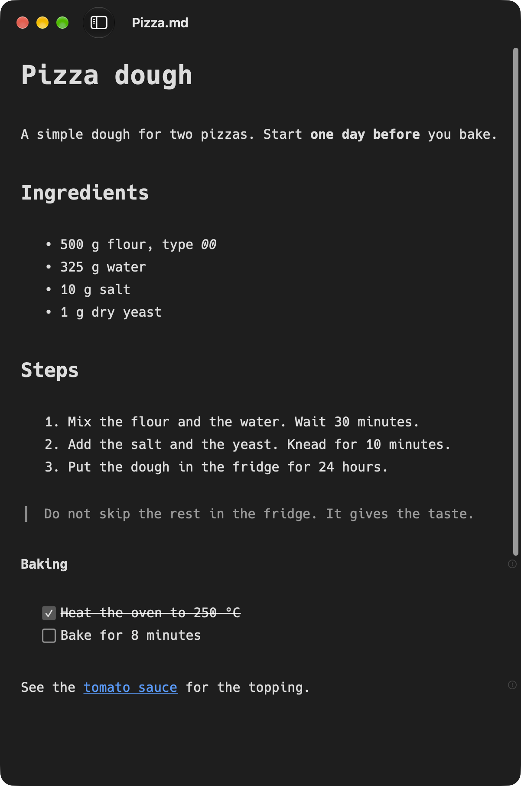

# Marc

<p align="center">
  
</p>

A small Markdown window for the terminal. Type `marc notes.md`, and the file opens in a native
macOS window with a live preview. Marc is a free macOS app.

Marc has a very limited feature set, and it is very opinionated. It is mostly a graphical user
interface that you control from the command line, and only then a Markdown editor. It is not a
fully featured Markdown editor, and it will not become one.

<p align="center">
  
</p>

## Why Marc

I live in the terminal. For code, a terminal editor is good. For Markdown, I want to see the text
the way that it reads: headings, lists, links, and images. The big Markdown apps have libraries,
sync, themes, and plugins. I only want to open a file, write, and close the window.

## Opinions

Marc makes the decisions for you. There are no settings.

- **Plain GitHub Flavored Markdown** — no wiki-links, no embeds, no LaTeX, no `==highlight==`.
- **One style** — when you save with `⌘S`, Marc formats the file: `-` for bullets, `*` for
  emphasis, `#` headings, fenced code blocks, `---` for rules. YAML front matter stays as it is.
  `⌘Z` reverts the format. Autosave does not format.
- **Live preview** — Marc hides the Markdown syntax while you type. There is no split view.
- **Two lint rules** — a link or image to a file that does not exist, and a heading level jump
  (for example H1 to H3). A small icon shows on the line. Click it to see the message.

## Install

macOS 26 or later, and Xcode 27 to build. There is no binary release. Build and install from
source:

```sh
git clone https://github.com/marcboeker/marc
cd marc
make install
```

This copies `Marc.app` to `/Applications` and puts a symbolic link to the `marc` command in
`~/.local/bin`. Make sure that `~/.local/bin` is in your `PATH`. To use a different folder, set
`PREFIX`, for example `make install PREFIX=/usr/local`.

You can also install the command later from the app: **Marc → Install Command Line Tool…**.

## The `marc` command

```sh
marc                      # open Marc
marc README.md            # open a file
marc todo.md ideas.md     # open more files, each in its own window
marc new-note.md          # the file does not exist: Marc makes an empty file and opens it
marc https://example.com  # load a web page as Markdown into a new, unsaved document
```

- A missing file is made empty before it opens. Its folder must exist.
- A web page URL gives a new, unsaved document. Marc keeps only the main content of the page, and
  it removes navigation and footers. When you save, Marc proposes a file name from the first
  heading.
- Options such as `-n` (new app instance) or `-g` (keep the terminal in front) go to `open`.

## Features

- **Documents** — open, save, recent files, and window tabs, the same as in other macOS apps.
  `.md` and `.markdown` files.
- **Outline** — a sidebar with the headings of the document. Toggle it with `⌃⌘S`. Click a
  heading to go to it.
- **Pinned files** — pin a file with `⌥⌘P` or a right-click in the sidebar. Pins stay at the top
  of the sidebar, also after you close the file or quit Marc. `⌥⌘1` to `⌥⌘9` open them.
- **Drag and drop** — drop an image, and Marc writes ``. Drop a different file, and
  Marc writes a link. The path is relative to the Markdown file.
- **Paste from the web** — `⌘V` changes copied HTML into Markdown. `⌥⇧⌘V` pastes plain text.
- **Find and replace** — `⌘F` and `⌥⌘F`.
- **Print and PDF** — `⌘P` prints the document with a clean print style, and **File → Export as
  PDF…** writes a PDF. Relative images show.
- **Window size** — a new window opens at the size and position of the last window.

## Shortcuts

Each shortcut is a toggle: press it again to remove the format. Bold and italic without a
selection apply to the word at the cursor.

| Shortcut | Format |
| --- | --- |
| `⌘1` to `⌘6` | Heading 1 to 6 |
| `⌘0` | Paragraph |
| `⌘B` | Bold |
| `⌘I` | Italic |
| `⌘⇧X` | Strikethrough |
| `⌘E` | Inline code |
| `⌘⇧C` | Code block |
| `⌘K` | Link (uses the URL from the clipboard, if there is one) |
| `⌘'` | Quote |
| `⌘⇧8` | Bullet list |
| `⌘⇧7` | Numbered list |
| `⌘⇧T` | Task |
| `⌘⇧-` | Horizontal rule |

## Development

```sh
make run     # build a debug version and open it
make test    # run the unit tests
make build   # build only
make clean   # remove the build output
```

The editor is a fork of [swift-markdown-engine](https://github.com/nodes-app/swift-markdown-engine)
in `Packages/MarkdownEngine`. Marc also uses [swift-markdown](https://github.com/swiftlang/swift-markdown)
for format and lint, [Demark](https://github.com/steipete/Demark) for HTML to Markdown, and
[swift-cmark](https://github.com/swiftlang/swift-cmark) for print. See [DESIGN.md](DESIGN.md) for
the design.

## License

MIT, see [LICENSE](LICENSE).
